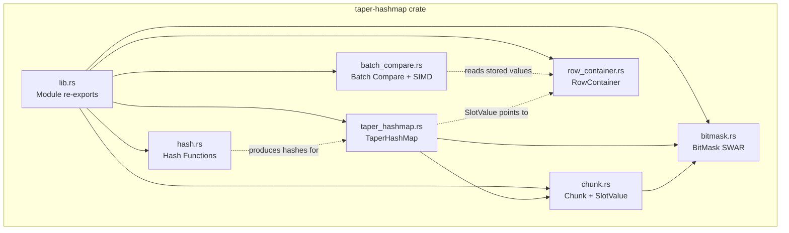
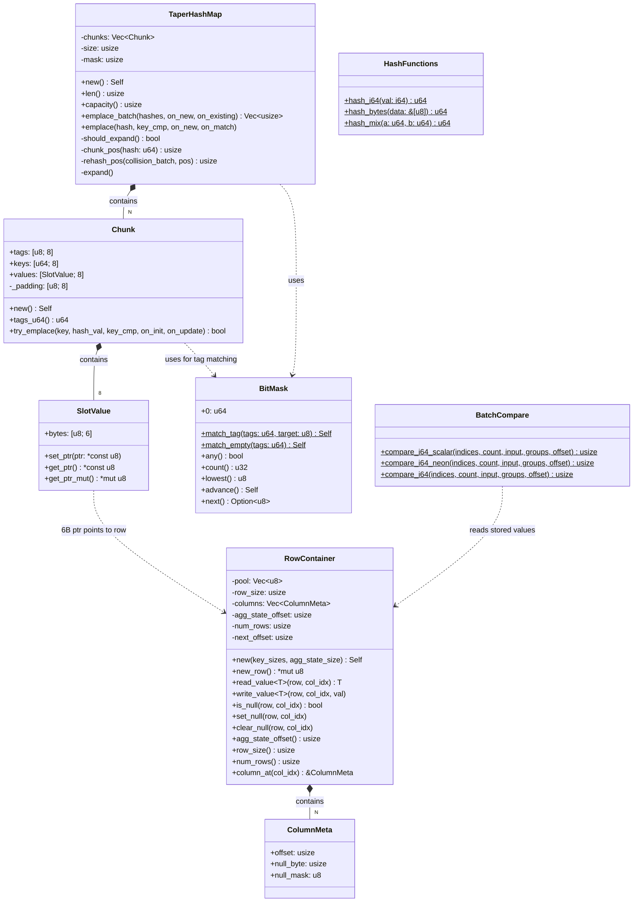
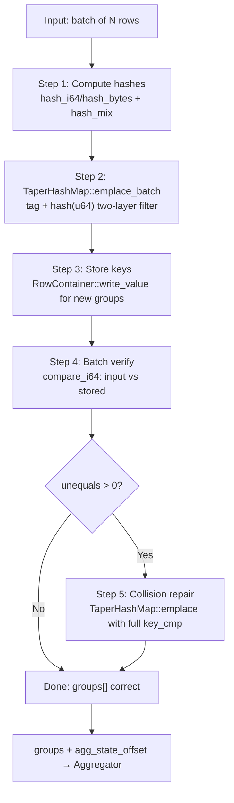
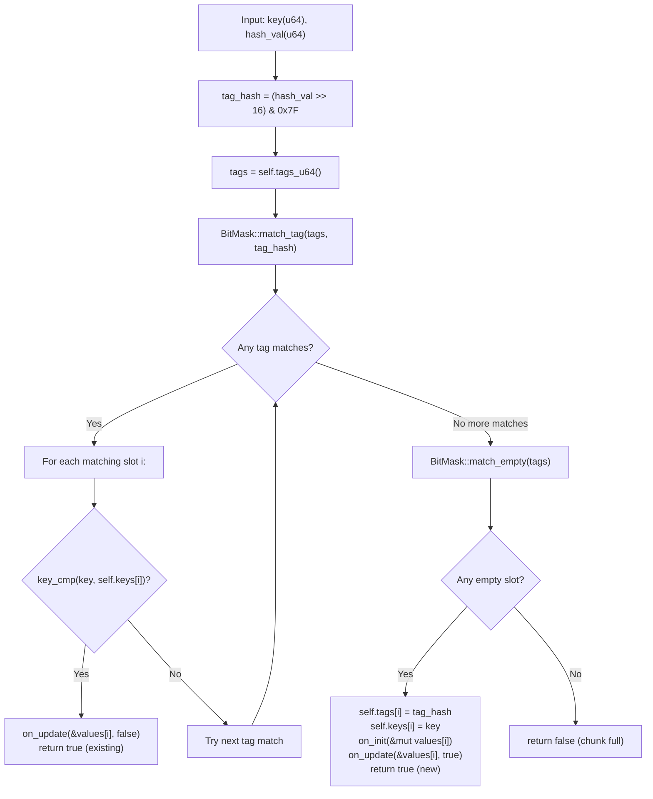

# Rust TaperHashMap — Comprehensive Design Document

## 1. Overview

`taper-hashmap` is a Rust implementation of the **OmniOperator C++ TaperHashTable** — a chunked, open-addressing hash table optimized for GROUP BY aggregation in columnar query engines. It provides high-throughput batch key grouping using a three-layer filtering strategy (tag → hash → full key compare) with deferred verification.

### Mapping to C++ OmniOperator

| C++ (OmniOperator)                      | Rust (this crate)                      |
|------------------------------------------|----------------------------------------|
| `TaperFlatHashTable<int64_t, true>`      | `TaperHashMap`                         |
| `TaperHashTableChunk`                    | `Chunk`                                |
| `PHBitMask`                              | `BitMask`                              |
| `SlotValue` (6-byte pointer)             | `SlotValue`                            |
| `RowContainer`                           | `RowContainer`                         |
| `TaperColumnSerializeHandler`            | `orchestrator::emplace_table_with_decode` (planned) |
| `DecodedVector`                          | `DecodedColumn` trait (planned)        |
| `EmplaceBatch`                           | `TaperHashMap::emplace_batch()`        |
| `TryEmplaceAtPos`                        | `Chunk::try_emplace()`                 |
| `GetUnequalsNumWithDecode`               | `batch_compare::compare_i64()`         |
| `SveBatchCompareDecoded`                 | `batch_compare::compare_i64_neon()`    |

---

## 2. Architecture Diagram



---

## 3. Module Descriptions

### 3.1 `lib.rs`

- **Purpose:** Crate root that declares and re-exports all public modules.
- **Public API:** `pub mod bitmask, chunk, taper_hashmap, row_container, batch_compare, hash`
- **Does NOT:** Contain any logic, types, or orchestration code.
- **C++ Correspondence:** N/A (Rust module system boilerplate).

### 3.2 `taper_hashmap.rs`

- **Purpose:** Core hash table struct providing batch and single-row emplace with linear probing across 128-byte chunks.
- **Public structs/functions:**
  ```rust
  pub struct TaperHashMap { chunks: Vec<Chunk>, size: usize, mask: usize }
  impl TaperHashMap {
      pub fn new() -> Self;
      pub fn len(&self) -> usize;
      pub fn capacity(&self) -> usize;
      pub fn emplace_batch(&mut self, hashes: &[u64],
          on_new: &mut dyn FnMut(usize, &mut SlotValue),
          on_existing: &mut dyn FnMut(usize, &SlotValue)) -> Vec<usize>;
      pub fn emplace(&mut self, hash: u64,
          key_cmp: &dyn Fn(&SlotValue) -> bool,
          on_new: &mut dyn FnMut(&mut SlotValue),
          on_match: &mut dyn FnMut(&SlotValue));
  }
  ```
- **Does NOT:** Store actual keys, manage RowContainer, or do full key comparison internally.
- **C++ Correspondence:** `TaperFlatHashTable::EmplaceBatch` + `TaperFlatHashTable::Emplace`.

### 3.3 `chunk.rs`

- **Purpose:** Defines the 128-byte cache-aligned chunk (8 slots) and the 6-byte compressed pointer `SlotValue`.
- **Public structs/functions:**
  ```rust
  #[repr(C, align(128))]
  pub struct Chunk {
      pub tags: [u8; 8],
      pub keys: [u64; 8],
      pub values: [SlotValue; 8],
  }
  impl Chunk {
      pub fn new() -> Self;
      pub fn tags_u64(&self) -> u64;
      pub fn try_emplace<FKeyCmp, FInit, FUpdate>(
          &mut self, key: u64, hash_val: u64,
          key_cmp: &FKeyCmp, on_init: &mut FInit, on_update: &mut FUpdate) -> bool;
  }

  #[repr(C)]
  pub struct SlotValue { pub bytes: [u8; 6] }
  impl SlotValue {
      pub fn set_ptr(&mut self, ptr: *const u8);
      pub fn get_ptr(&self) -> *const u8;
      pub fn get_ptr_mut(&self) -> *mut u8;
  }
  ```
- **Does NOT:** Manage multiple chunks, handle inter-chunk probing, or perform hash computation.
- **C++ Correspondence:** `TaperHashTableChunk` + `SlotValue` (6-byte pointer encoding).

### 3.4 `bitmask.rs`

- **Purpose:** SWAR (SIMD Within A Register) bit manipulation to compare 8 tags simultaneously in a single u64 operation.
- **Public structs/functions:**
  ```rust
  pub struct BitMask(pub u64);
  impl BitMask {
      pub fn match_tag(tags: u64, target: u8) -> Self;
      pub fn match_empty(tags: u64) -> Self;
      pub fn any(self) -> bool;
      pub fn count(self) -> u32;
      pub fn lowest(self) -> u8;
      pub fn advance(self) -> Self;
  }
  impl Iterator for BitMask { type Item = u8; }
  ```
- **Does NOT:** Access chunk memory directly, perform key comparison, or use actual SIMD instructions (pure scalar SWAR).
- **C++ Correspondence:** `PHBitMask` in OmniOperator.

### 3.5 `row_container.rs`

- **Purpose:** Row-oriented memory pool that stores group keys and aggregation state; provides typed read/write and null tracking.
- **Public structs/functions:**
  ```rust
  pub struct ColumnMeta { pub offset: usize, pub null_byte: usize, pub null_mask: u8 }

  pub struct RowContainer { /* pool, row_size, columns, agg_state_offset, num_rows, next_offset */ }
  impl RowContainer {
      pub fn new(key_sizes: &[usize], agg_state_size: usize) -> Self;
      pub fn new_row(&mut self) -> *mut u8;
      pub fn read_value<T: Copy>(&self, row: *const u8, col_idx: usize) -> T;
      pub fn write_value<T: Copy>(&self, row: *mut u8, col_idx: usize, val: T);
      pub fn is_null(&self, row: *const u8, col_idx: usize) -> bool;
      pub fn set_null(&self, row: *mut u8, col_idx: usize);
      pub fn clear_null(&self, row: *mut u8, col_idx: usize);
      pub fn agg_state_offset(&self) -> usize;
      pub fn row_size(&self) -> usize;
      pub fn num_rows(&self) -> usize;
      pub fn column_at(&self, col_idx: usize) -> &ColumnMeta;
  }
  ```
- **Does NOT:** Perform hash lookups, manage groups, or do key comparison. It is a passive storage backend.
- **C++ Correspondence:** `RowContainer` in OmniOperator (simplified: no page-based allocation, no variable-length strings yet).

### 3.6 `batch_compare.rs`

- **Purpose:** Batch Stage-2 key verification — compares input column values against values stored in RowContainer, partitioning indices into equal/unequal. Supports both i64 and i32 with NEON SIMD acceleration on aarch64.
- **Public functions:**
  ```rust
  // i64 comparison
  pub fn compare_i64_scalar(indices, count, input_values, groups, offset) -> usize;
  #[cfg(target_arch = "aarch64")]
  pub fn compare_i64_neon(indices, count, input_values, groups, offset) -> usize;  // 2×i64 per NEON op
  pub fn compare_i64(indices, count, input_values, groups, offset) -> usize;       // auto-dispatch

  // i32 comparison
  pub fn compare_i32_scalar(indices, count, input_values, groups, offset) -> usize;
  #[cfg(target_arch = "aarch64")]
  pub fn compare_i32_neon(indices, count, input_values, groups, offset) -> usize;  // 4×i32 per NEON op
  pub fn compare_i32(indices, count, input_values, groups, offset) -> usize;       // auto-dispatch
  ```
- **NEON details:**
  - `compare_i64_neon`: uses `vceqq_s64` to compare 2 int64 pairs per iteration (128-bit register)
  - `compare_i32_neon`: uses `vceqq_s32` to compare 4 int32 pairs per iteration (128-bit register)
  - Fallback: remaining rows processed scalar
- **Does NOT:** Handle multi-column comparison (single column per call), manage RowContainer lifecycle, or do hash lookups.
- **C++ Correspondence:** `GetUnequalsNumWithDecode` + `SveBatchCompareDecoded` / `SveBatchCompareNoNullDecoded`.

### 3.7 `hash.rs`

- **Purpose:** Platform-dispatched hash computation — CRC32 hardware intrinsics for integers, FNV-1a for byte slices, boost-style hash_mix for multi-column combining.
- **Public functions:**
  ```rust
  pub fn hash_i64(val: i64) -> u64;      // CRC32 on ARM/x86, FxHash fallback
  pub fn hash_bytes(data: &[u8]) -> u64;  // FNV-1a
  pub fn hash_mix(a: u64, b: u64) -> u64; // boost::hash_combine variant
  ```
- **Does NOT:** Know about columns, batches, or the hash table structure. Pure stateless hash functions.
- **C++ Correspondence:** `OmniHashCombine` + `CrcHash32` in OmniOperator hash utilities.

---

## 4. UML Class Diagram



---

## 5. Interface Design — Complete Public API Signatures

### 5.1 TaperHashMap

```rust
pub struct TaperHashMap { /* private */ }

impl TaperHashMap {
    /// Create hash table with 16 chunks (128 slots initial capacity).
    pub fn new() -> Self;

    /// Number of occupied slots (distinct groups).
    pub fn len(&self) -> usize;

    /// Total slot capacity (chunks × 8).
    pub fn capacity(&self) -> usize;

    /// Batch emplace: tag+hash two-layer filter.
    /// Returns update_indices (rows needing Stage 2 full-key verification).
    pub fn emplace_batch(
        &mut self,
        hashes: &[u64],
        on_new: &mut dyn FnMut(usize, &mut SlotValue),
        on_existing: &mut dyn FnMut(usize, &SlotValue),
    ) -> Vec<usize>;

    /// Single-row emplace with full key comparison (collision repair).
    pub fn emplace(
        &mut self,
        hash: u64,
        key_cmp: &dyn Fn(&SlotValue) -> bool,
        on_new: &mut dyn FnMut(&mut SlotValue),
        on_match: &mut dyn FnMut(&SlotValue),
    );
}
```

### 5.2 Chunk

```rust
#[repr(C, align(128))]
pub struct Chunk {
    pub tags: [u8; 8],
    pub keys: [u64; 8],
    pub values: [SlotValue; 8],
}

impl Chunk {
    pub fn new() -> Self;
    pub fn tags_u64(&self) -> u64;

    /// Try to emplace in this chunk. Returns false if chunk is full.
    pub fn try_emplace<FKeyCmp, FInit, FUpdate>(
        &mut self,
        key: u64,
        hash_val: u64,
        key_cmp: &FKeyCmp,      // Fn(u64, u64) -> bool
        on_init: &mut FInit,     // FnMut(&mut SlotValue)
        on_update: &mut FUpdate, // FnMut(&SlotValue, bool)
    ) -> bool;
}
```

### 5.3 BitMask

```rust
#[derive(Clone, Copy)]
pub struct BitMask(pub u64);

impl BitMask {
    /// SWAR: find slots where tag == target. O(1), no SIMD.
    pub fn match_tag(tags: u64, target: u8) -> Self;

    /// Find empty slots (tag == 0x80).
    pub fn match_empty(tags: u64) -> Self;

    pub fn any(self) -> bool;
    pub fn count(self) -> u32;
    pub fn lowest(self) -> u8;
    pub fn advance(self) -> Self;
}

impl Iterator for BitMask {
    type Item = u8;  // yields slot indices 0..7
    fn next(&mut self) -> Option<u8>;
}
```

### 5.4 SlotValue

```rust
#[repr(C)]
#[derive(Clone, Copy, Default)]
pub struct SlotValue {
    pub bytes: [u8; 6],
}

impl SlotValue {
    /// Store pointer (lower 48 bits of address).
    pub fn set_ptr(&mut self, ptr: *const u8);

    /// Read back as immutable pointer.
    pub fn get_ptr(&self) -> *const u8;

    /// Read back as mutable pointer.
    pub fn get_ptr_mut(&self) -> *mut u8;
}
```

### 5.5 RowContainer

```rust
pub struct RowContainer { /* private */ }

impl RowContainer {
    /// Create with key column sizes and aggregation state size.
    pub fn new(key_sizes: &[usize], agg_state_size: usize) -> Self;

    /// Allocate a new zero-initialized row. Returns pointer to row start.
    pub fn new_row(&mut self) -> *mut u8;

    /// Read typed value from column col_idx in given row.
    pub fn read_value<T: Copy>(&self, row: *const u8, col_idx: usize) -> T;

    /// Write typed value to column col_idx in given row.
    pub fn write_value<T: Copy>(&self, row: *mut u8, col_idx: usize, val: T);

    /// Check if column is null.
    pub fn is_null(&self, row: *const u8, col_idx: usize) -> bool;

    /// Set null flag.
    pub fn set_null(&self, row: *mut u8, col_idx: usize);

    /// Clear null flag.
    pub fn clear_null(&self, row: *mut u8, col_idx: usize);

    /// Byte offset where aggregation state begins.
    pub fn agg_state_offset(&self) -> usize;
}
```

### 5.6 DecodedColumn Trait (Planned)

```rust
/// Abstraction over decoded input columns (not yet in crate, planned).
pub trait DecodedColumn {
    fn get_value_i64(&self, row_idx: usize) -> i64;
    fn get_value_bytes(&self, row_idx: usize) -> &[u8];
    fn is_null(&self, row_idx: usize) -> bool;
    fn has_null(&self) -> bool;
}
```

### 5.7 orchestrator::emplace_table_with_decode (Planned)

```rust
/// Orchestrate the full 5-step emplace pipeline (not yet in crate, planned).
pub fn emplace_table_with_decode(
    table: &mut TaperHashMap,
    row_container: &mut RowContainer,
    decoded_cols: &[&dyn DecodedColumn],
    hashes: &[u64],
    groups: &mut [*const u8],
) -> usize;  // returns number of new groups created
```

### 5.8 Hash Functions

```rust
/// CRC32-based hash for i64 (hardware intrinsic on ARM/x86).
pub fn hash_i64(val: i64) -> u64;

/// FNV-1a hash for byte slices.
pub fn hash_bytes(data: &[u8]) -> u64;

/// Multi-column hash combination (boost::hash_combine variant).
pub fn hash_mix(a: u64, b: u64) -> u64;
```

### 5.9 Batch Compare Functions

```rust
// ─── i64 ───
/// Scalar: compare i64 values, partition indices into unequal (front) / equal.
pub fn compare_i64_scalar(
    indices: &mut [u32], count: usize,
    input_values: &[i64], groups: &[*const u8], offset: usize,
) -> usize;  // returns unequals_num

/// NEON: 2×i64 parallel compare (aarch64 only).
#[cfg(target_arch = "aarch64")]
pub fn compare_i64_neon(
    indices: &mut [u32], count: usize,
    input_values: &[i64], groups: &[*const u8], offset: usize,
) -> usize;

/// Auto-dispatch to best platform implementation (i64).
pub fn compare_i64(
    indices: &mut [u32], count: usize,
    input_values: &[i64], groups: &[*const u8], offset: usize,
) -> usize;

// ─── i32 ───
/// Scalar: compare i32 values.
pub fn compare_i32_scalar(
    indices: &mut [u32], count: usize,
    input_values: &[i32], groups: &[*const u8], offset: usize,
) -> usize;

/// NEON: 4×i32 parallel compare (aarch64 only).
#[cfg(target_arch = "aarch64")]
pub fn compare_i32_neon(
    indices: &mut [u32], count: usize,
    input_values: &[i32], groups: &[*const u8], offset: usize,
) -> usize;

/// Auto-dispatch to best platform implementation (i32).
pub fn compare_i32(
    indices: &mut [u32], count: usize,
    input_values: &[i32], groups: &[*const u8], offset: usize,
) -> usize;
```

---

## 6. Data Flow Diagram

```mermaid
flowchart LR
    subgraph Input
        VB[Input Batch<br/>columns + row count]
    end

    subgraph Step1["Step 1: Hash"]
        HC[hash_i64 / hash_bytes<br/>+ hash_mix per column]
        HV["hashes: Vec&lt;u64&gt;"]
    end

    subgraph Step2["Step 2: Batch Emplace"]
        TM[TaperHashMap::emplace_batch<br/>tag + hash filter]
    end

    subgraph Step2Out["Step 2 Outputs"]
        GR["groups[]: Vec&lt;*const u8&gt;"]
        UL["update_indices: Vec&lt;usize&gt;"]
    end

    subgraph Step3["Step 3: Store Keys"]
        SK[RowContainer::write_value<br/>store key cols in new groups]
    end

    subgraph Step4["Step 4: Batch Verify"]
        BC[compare_i64<br/>stored vs input per column]
    end

    subgraph Step4Out["Step 4 Output"]
        UE["unequals: indices[0..n]"]
    end

    subgraph Step5["Step 5: Collision Repair"]
        EM[TaperHashMap::emplace<br/>full key compare + new_row]
    end

    subgraph Output
        FINAL["groups[] fully resolved<br/>→ Aggregator"]
    end

    VB --> HC --> HV --> TM
    TM -->|empty slot: on_new| GR
    TM -->|hash match: on_existing| UL
    UL --> GR
    GR --> Step3
    Step3 --> BC
    UL --> BC
    BC -->|all equal| FINAL
    BC -->|unequals| UE --> EM
    EM --> FINAL
```



---

## 7. Call Chain

Complete call stack from the orchestrator down to the lowest-level functions:

```
emplace_table_with_decode()                         [orchestrator — planned]
│
├── hash_i64() / hash_bytes()                       [hash.rs]
│     └── hash_mix()                                [hash.rs] (multi-col combine)
│
├── TaperHashMap::emplace_batch()                   [taper_hashmap.rs]
│     ├── TaperHashMap::should_expand()
│     │     └── TaperHashMap::expand()
│     │           └── TaperHashMap::emplace() (rehash, key_cmp=|_|false)
│     │
│     └── for each row:
│           └── loop (linear probe across chunks):
│                 ├── Chunk::tags_u64()             [chunk.rs]
│                 │     └── u64::from_le_bytes()
│                 ├── BitMask::match_tag()          [bitmask.rs]
│                 │     └── SWAR: XOR → SUB → AND
│                 ├── BitMask::Iterator::next()
│                 │     └── BitMask::lowest()
│                 │     └── BitMask::advance()
│                 ├── chunk.keys[slot] == hash      (u64 compare)
│                 ├── on_new(row_idx, &mut slot.values[slot])
│                 │     └── RowContainer::new_row() [row_container.rs]
│                 │     └── SlotValue::set_ptr()    [chunk.rs]
│                 ├── on_existing(row_idx, &slot.values[slot])
│                 │     └── SlotValue::get_ptr()    [chunk.rs]
│                 ├── BitMask::match_empty()        [bitmask.rs]
│                 └── TaperHashMap::rehash_pos()    (next chunk)
│
├── RowContainer::write_value()                     [row_container.rs]
│     └── (store key column values into new group rows)
│
├── compare_i64() / compare_i64_scalar()            [batch_compare.rs]
│     ├── compare_i64_neon()                        [aarch64 only]
│     │     └── NEON: vcombine_s64, vceqq_s64, vgetq_lane_u64
│     └── for each row in update_indices:
│           ├── row.add(offset) → read stored i64
│           ├── input_values[idx] → read input i64
│           └── stored != input → swap to front
│
└── TaperHashMap::emplace()                         [taper_hashmap.rs]
      └── loop (linear probe):
            ├── Chunk::tags_u64()
            ├── BitMask::match_tag()
            ├── chunk.keys[slot] == hash
            ├── key_cmp(&slot.values[slot])         (full key compare)
            │     └── RowContainer::read_value()
            │     └── DecodedColumn::get_value()    (planned)
            ├── on_match(&slot.values[slot])
            ├── BitMask::match_empty()
            └── on_new(&mut slot.values[slot])
                  └── RowContainer::new_row()
                  └── RowContainer::write_value()
```

---

## 8. Flowcharts

### 8.1 Overall 5-Step Emplace Flow



### 8.2 Chunk::try_emplace Internal Logic



### 8.3 emplace_batch Loop Logic

```mermaid
flowchart TD
    A["For each (row_idx, hash) in hashes:"] --> B["pos = hash & mask<br/>collision_batch = 1"]
    B --> C["chunk = &mut chunks[pos]<br/>tag_hash = (hash >> 16) & 0x7F<br/>tags = chunk.tags_u64()"]
    C --> D["BitMask::match_tag(tags, tag_hash)"]
    D --> E{Found slot where keys[i] == hash?}
    E -->|Yes| F["on_existing(row_idx, &values[i])<br/>update_indices.push(row_idx)<br/>break"]
    E -->|No tag+key match| G["BitMask::match_empty(tags)"]
    G --> H{Found empty slot?}
    H -->|Yes| I["tags[i] = tag_hash<br/>keys[i] = hash<br/>on_new(row_idx, &mut values[i])<br/>size += 1<br/>break"]
    H -->|No (chunk full)| J["pos = rehash_pos(collision_batch, pos)<br/>collision_batch += 1"]
    J --> C
```

### 8.4 get_unequals_num Per-Column Filtering (compare_i64_scalar)

```mermaid
flowchart TD
    A["Input: indices[0..count], input_values, groups, offset"] --> B["idx_from = 0"]
    B --> C["For i in 0..count:"]
    C --> D["idx = indices[i]<br/>row = groups[idx]"]
    D --> E["stored = read i64 at row + offset<br/>input = input_values[idx]"]
    E --> F{stored != input?}
    F -->|Yes (unequal)| G["swap indices[i] ↔ indices[idx_from]<br/>idx_from += 1"]
    F -->|No (equal)| H["continue"]
    G --> C
    H --> C
    C -->|done| I["return idx_from (= unequals_num)<br/>indices[0..idx_from] = unequal rows"]
```

### 8.5 Single-Row Emplace Collision Repair

```mermaid
flowchart TD
    A["Input: hash, key_cmp, on_new, on_match"] --> B["pos = chunk_pos(hash)<br/>collision_batch = 1"]
    B --> C["chunk = chunks[pos]<br/>tag_hash = (hash >> 16) & 0x7F<br/>tags = chunk.tags_u64()"]
    C --> D["BitMask::match_tag(tags, tag_hash)"]
    D --> E{For each matching slot i:}
    E --> F{"keys[i] == hash AND key_cmp(&values[i])?"}
    F -->|Yes| G["on_match(&values[i])<br/>return"]
    F -->|No| H["Try next match"]
    H --> E
    E -->|No more matches| I["BitMask::match_empty(tags)"]
    I --> J{Found empty slot?}
    J -->|Yes| K["tags[i] = tag_hash<br/>keys[i] = hash<br/>on_new(&mut values[i])<br/>size += 1<br/>return"]
    J -->|No (chunk full)| L["pos = rehash_pos(collision_batch, pos)<br/>collision_batch += 1"]
    L --> C
```

---

## 9. Memory Layout

### 9.1 Chunk (128 Bytes) — `#[repr(C, align(128))]`

```
┌─────────────────────────────────────────────────────────────────────────────┐
│ Offset 0–7:   tags[8]   (1 byte × 8)                                       │
│ ┌──────┬──────┬──────┬──────┬──────┬──────┬──────┬──────┐                  │
│ │ 0x2A │ 0x3F │ 0x80 │ 0x80 │ 0x80 │ 0x80 │ 0x80 │ 0x80 │                  │
│ │slot 0│slot 1│empty │empty │empty │empty │empty │empty │                  │
│ └──────┴──────┴──────┴──────┴──────┴──────┴──────┴──────┘                  │
├─────────────────────────────────────────────────────────────────────────────┤
│ Offset 8–71:  keys[8]   (8 bytes × 8 = 64 bytes)                           │
│ ┌────────────┬────────────┬────────────┬─── ... ───┬────────────┐           │
│ │ 0x0000002A │ 0x0000004D │ 0x00000000 │    ...    │ 0x00000000 │           │
│ │  hash=42   │  hash=77   │   unused   │           │   unused   │           │
│ └────────────┴────────────┴────────────┴─── ... ───┴────────────┘           │
├─────────────────────────────────────────────────────────────────────────────┤
│ Offset 72–119: values[8]  (6 bytes × 8 = 48 bytes)                         │
│ ┌────────┬────────┬────────┬─── ... ───┬────────┐                          │
│ │ →row G0│ →row G1│ 000000 │    ...    │ 000000 │                          │
│ │ 6B ptr │ 6B ptr │ empty  │           │ empty  │                          │
│ └────────┴────────┴────────┴─── ... ───┴────────┘                          │
├─────────────────────────────────────────────────────────────────────────────┤
│ Offset 120–127: _padding[8]  (alignment fill)                              │
└─────────────────────────────────────────────────────────────────────────────┘
Total: 8 + 64 + 48 + 8 = 128 bytes (fits 1–2 cache lines)
```

### 9.2 RowContainer Row Layout

For a table with columns `city: i64(8B)`, `gender: i64(8B)`, `agg_state: i64(8B)`:

```
┌─────────┬──────────────────┬─────────┬──────────────────┬──────────────────┐
│ null_0  │ col_0 value      │ null_1  │ col_1 value      │ agg_state        │
│ 1 byte  │ 8 bytes (i64)   │ 1 byte  │ 8 bytes (i64)   │ 8 bytes (i64)   │
│offset=0 │ offset=1         │offset=9 │ offset=10        │ offset=18        │
└─────────┴──────────────────┴─────────┴──────────────────┴──────────────────┘
 ← key_sizes=[8,8] →                                       ← agg_state_size=8 →

Total row_size = 1 + 8 + 1 + 8 + 8 = 26 bytes

Null encoding: null_byte & null_mask != 0  →  column IS NULL
  - null_mask is always 0x01 in current impl (one null bit per byte)
```

### 9.3 SlotValue Encoding (6-Byte Compressed Pointer)

```
SlotValue.bytes[6]:
┌──────┬──────┬──────┬──────┬──────┬──────┐
│ b[0] │ b[1] │ b[2] │ b[3] │ b[4] │ b[5] │  ← little-endian bytes
└──────┴──────┴──────┴──────┴──────┴──────┘
         = lower 48 bits of a *const u8

set_ptr: val.to_le_bytes()[0..6] → bytes
get_ptr: [bytes[0..6], 0, 0]    → u64 → *const u8

Why 6 bytes: x86_64/aarch64 virtual addresses use only 48 bits.
Saves 2 bytes per slot vs full 8-byte pointer (16B saved per chunk).
```

---

## 10. Data Flow Example — 6 Rows with Hash Collision

**Scenario:** GROUP BY `(city, gender)` with 6 input rows.

| Row | city   | gender | hash (pre-computed) |
|-----|--------|--------|---------------------|
| 0   | 北京   | 男     | 42                  |
| 1   | 上海   | 女     | 77                  |
| 2   | 北京   | 男     | 42                  |
| 3   | 深圳   | 女     | 42 ← **hash collision with row 0!** |
| 4   | 上海   | 女     | 77                  |
| 5   | 北京   | 女     | 63                  |

### Step 1: Hash Computation

```
hashes = [42, 77, 42, 42, 77, 63]
```

### Step 2: emplace_batch (tag + hash filter only)

```
row 0: hash=42 → chunk[pos] empty      → on_new  → G0 = new_row()   → groups[0]=G0
row 1: hash=77 → chunk[pos'] empty     → on_new  → G1 = new_row()   → groups[1]=G1
row 2: hash=42 → tag+key match slot[0] → on_existing → groups[2]=G0
                                         update_indices = [2]
row 3: hash=42 → tag+key match slot[0] → on_existing → groups[3]=G0
                                         update_indices = [2, 3]
row 4: hash=77 → tag+key match slot[1] → on_existing → groups[4]=G1
                                         update_indices = [2, 3, 4]
row 5: hash=63 → chunk[pos''] empty    → on_new  → G5 = new_row()   → groups[5]=G5
```

**After Step 2:**
- `groups = [G0, G1, G0, G0, G1, G5]`
- `update_indices = [2, 3, 4]`
- New groups: G0, G1, G5

### Step 3: Store Keys into New Groups

```
RowContainer::write_value(G0, col0, hash("北京"))  // city
RowContainer::write_value(G0, col1, hash("男"))    // gender
RowContainer::write_value(G1, col0, hash("上海"))
RowContainer::write_value(G1, col1, hash("女"))
RowContainer::write_value(G5, col0, hash("北京"))
RowContainer::write_value(G5, col1, hash("女"))
```

### Step 4: Batch Verify (compare_i64 for each key column)

```
Column 0 (city) comparison:
  row 2: stored=hash("北京") vs input=hash("北京") → EQUAL ✓
  row 3: stored=hash("北京") vs input=hash("深圳") → NOT EQUAL ✗
  row 4: stored=hash("上海") vs input=hash("上海") → EQUAL ✓

After col 0: unequals=[3], remaining to check cols: [2, 4] (already passed)

Column 1 (gender) — only check remaining equals [2, 4]:
  row 2: stored=hash("男") vs input=hash("男") → EQUAL ✓
  row 4: stored=hash("女") vs input=hash("女") → EQUAL ✓

Final: unequals_num = 1, unequal_indices = [3]
```

### Step 5: Collision Repair for Row 3

```
TaperHashMap::emplace(hash=42, key_cmp, on_new, on_match):
  → chunk[pos], slot[0]: keys[0]==42 ✓, key_cmp(G0) = compare(北京,男) vs (深圳,女) → false
  → no more tag matches in chunk
  → find empty slot[2] in same chunk
  → tags[2] = tag(42), keys[2] = 42
  → on_new: G3 = RowContainer::new_row()
  → write_value(G3, col0, hash("深圳"))
  → write_value(G3, col1, hash("女"))
  → groups[3] = G3
```

### Final Result

```
groups = [G0, G1, G0, G3, G1, G5]
          北京男 上海女 北京男 深圳女 上海女 北京女
          4 distinct groups total
```

---

## 11. Comparison with C++ Version

### What's the Same

| Aspect | Detail |
|--------|--------|
| Chunk structure | 128B aligned, 8 slots per chunk: [tags 8B][keys 64B][values 48B][pad 8B] |
| Tag encoding | 7-bit fingerprint from `(hash >> 16) & 0x7F`, empty = 0x80 |
| SWAR algorithm | Identical bit manipulation: `(x - 0x0101...) & ~x & 0x8080...` |
| Three-layer filter | tag → hash(u64) → full key compare (same deferred verification strategy) |
| Linear probing | Inter-chunk stepping (not per-slot), `pos = (pos + batch) & mask` |
| 6-byte pointer | Lower 48 bits of address stored in slot value |
| Batch emplace flow | 5-step pipeline: hash → batch probe → store keys → verify → repair |
| Load factor | 0.9 threshold triggers 2× expansion |
| Expand strategy | Allocate 2× chunks, rehash all entries (insert-only, `key_cmp=|_| false`) |
| Null tracking | Per-column null byte in row layout |

### What's Different / Simplified

| Aspect | C++ | Rust |
|--------|-----|------|
| Memory allocator | Custom pool allocator with pages | Simple `Vec<u8>` growing pool |
| Row container | Page-based with overflow | Flat contiguous `Vec<u8>` |
| Variable-length types | `VARCHAR` with inline/overflow | Not yet implemented (i64 only) |
| DecodedColumn | Template-specialized `DecodedVector<T>` | Planned trait (`DecodedColumn`) |
| Orchestrator | `TaperColumnSerializeHandler` class hierarchy | Not yet implemented (planned `orchestrator.rs`) |
| SIMD tag compare | Optional SVE/NEON 128-bit | SWAR only (no SIMD for tags) |
| SIMD key compare | SVE (scalable vector) + NEON | NEON `vceqq_s64` (2×i64) + `vceqq_s32` (4×i32) on aarch64, scalar fallback |
| Multi-column compare | Integrated in `GetUnequalsNumWithDecode` | Single-column `compare_i64`; multi-col loop is caller's job |
| Hash function | Custom `OmniHashCombine` + `CrcHash32` | Same CRC32 intrinsics + FNV-1a + boost hash_combine |
| Error handling | C++ exceptions / error codes | Panics on invariant violations (no Result<> yet) |
| Thread safety | External locking | Not addressed (single-threaded design) |
| Generics | C++ templates `<KeyType, KeyScattered>` | Fixed `u64` key; generics via closures (`on_new`, `key_cmp`) |
| Build target | Linux aarch64 (Kunpeng) | Cross-platform (aarch64 + x86_64 + fallback) |
| Test infrastructure | Google Test + internal benchmarks | Rust `#[cfg(test)]` inline unit tests |
| Aggregation state | Integrated in table handler | Caller manages via `agg_state_offset()` pointer math |

### Key Architectural Simplifications

1. **No template explosion**: C++ uses heavy templates for type dispatch. Rust uses trait objects and closures for the same polymorphism with less compile-time cost.

2. **No page-based allocation**: C++ RowContainer uses paged memory for cache locality across NUMA nodes. Rust version uses a simple growing Vec — adequate for correctness validation, needs upgrading for production.

3. **No SVE support**: C++ targets Kunpeng 920 (ARMv8.2 SVE). Rust version targets stable NEON (ARMv8.0) which is more portable.

4. **Separated concerns**: In C++, `TaperColumnSerializeHandler` owns the entire pipeline. In Rust, each step is a standalone function/module that can be tested independently.
